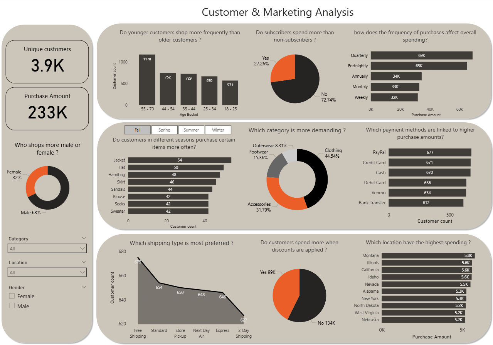
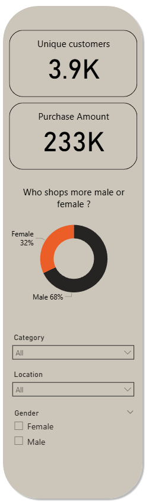
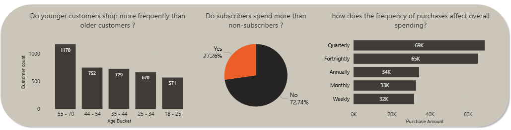
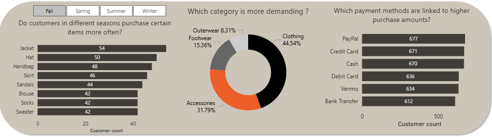
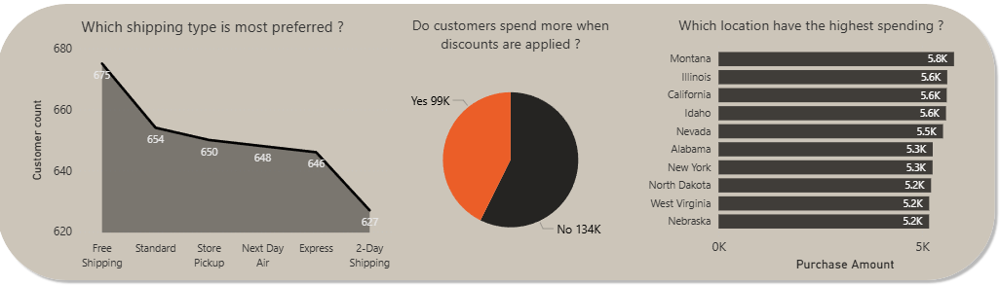

# Customer-Marketing-Analysis dashboard

## **Problems to solve**

1- Which location have the highest spending or purchase frequency ?  
2- do younger customers shop more frequently than older customers   
3- how does the frequency of purchases (weekly, monthly, annually) affect overall spending?  
4- Do customers in different seasons (Winter, Summer, etc.) purchase certain items more often?  
5- Do customers spend more when discounts or promo codes are applied?  
6- Which payment methods (Credit Card, PayPal, Cash, etc.) are linked to higher purchase amounts?  
 8- Which shipping type (Express, Free Shipping, Store Pickup, etc.) is most preferred ?
 9- What impact do subscription status have on spending?

# Insights Breakdown

### **Left Side (KPIs & Demographics)**

- **Unique Customers** (3.9K)
→ Shows the total number of individual customers in the dataset. This is a core metric of customer reach.

- **Purchase Amount** (233K)
→ Total value of purchases made. This represents the overall revenue in the period covered.

- **Who shops more male or female?** (Donut Chart)
→ Displays the gender split: 68% male vs 32% female. This indicates that the majority of the customer base is male, suggesting marketing is more effective with men or product lines appeal more to them.  
  
  - **Decision** : Gender Split (Male 68%, Female 32%) : Focus current campaigns on men but explore why female engagement is lower. 

## **Top Row**

- **Do younger customers shop more frequently than older customers? (Bar Chart by Age Bucket) →** Older customers (55–70) have the highest customer count (1178), meaning they shop more than younger age groups. So younger customers are less engaged.
   - **Decision** : Highlight comfort, quality and premium options in marketing for this age group (55+) 

- **What impact do subscription statuses have on spending? (Pie Chart) →** Shows that only 27% are subscribers, and they spend more on average. Subscriptions boost spending, but most customers are still non-subscribers (73%).
   - **Decision** : offer sign-up discounts, bundle deals, or exclusive perks to incresase subscriber base

- **How does the frequency of purchases affect overall spending? (Bar Chart) →** Customers who shop quarterly (69K) and fortnightly (65K) generate the highest spending, while weekly and monthly shoppers spend less. Suggests high-value customers shop less often but spend more per purchase.
  - **Decision** : Encourage quarterly and fortnightly byers with loyalty rewards

## **Middle Row**

- **Do customers in different seasons purchase certain items more often? (Bar Chart with Seasonal Slicer) →** Allows filtering by season. Jackets (54) and hats (50) are the top purchased items, showing seasonal patterns in demand. Businesses can use this for seasonal promotions.
   - **Decision** : stock more items of the items thats most preferred in peak seasons, run promotions around these items

- **Which category is more demanding? (Pie Chart) →** Clothing dominates demand (44.5%), followed by accessories (31.8%) and footwear (15%). Outerwear is the smallest segment. Inventory and marketing should prioritize clothing.
    - **Decision** : clothing should remain the main revenue driver but accessories are a strong secondary too. we can make a cross-sellaccessories with clothing orders 

- **Which payment methods are linked to higher purchase amounts? (Bar Chart) →** PayPal (677) and Credit Cards (671) lead slightly over Cash (670). Debit Card, Venmo, and Bank Transfer are less used. This suggests promoting digital payment methods can align with customer preference.

## **Bottom Row**

- **Which shipping type is most preferred ? (Line Chart) →** Free Shipping (675) is the most preferred, followed by Express (654). Premium shipping options (Next Day, 2-Day Air) have low purchase amounts. Customers strongly value free/low-cost shipping.

- **Do customers spend more when discounts are applied? (Pie Chart) →** Yes: 99K purchases vs No: 134K. Customers spend significantly more when discounts are offered, confirming discounts are an effective sales driver.
    - **Decision** : keep using discounts, but measure profitability

- **Which locations have the highest spending? (Bar Chart by State) →** Top spenders: Montana (5.8K), Illinois (5.6K), California (5.6K). These states generate the highest purchase amounts, guiding where to focus regional campaigns.
    - **Decision** : Focus regional marketing campaigns and ads on these high-spend states

## 🛠️ Tools & Skills Demonstrated

- 🧹 **Data Cleaning & Preparation** (Excel → Power BI integration)  
- ⚙️ **Data Transformation (ETL) with Power Query:** Cleaned, shaped, and prepared the raw data for analysis by handling blanks, changing data types, and creating 
new columns.
- 🧮 **Data Modeling & DAX calculations:** Formulated measures to derive key insights and KPIS like Total sales, total customers and purchase amount.
- 📊 **Core Charts:** Utilized **Column, Bar, Line, pie chart and dount chart** 
- 🎨 **Dashboard Design:** Designed an intuitive and visually appealing layout

## 💡 Business Value

This dashboard empowers businesses to know their customers, target ther rigght audience, optimize promotion, improve logistics, and focus resources on high-value areas. it enables data-driven decisions that increase sales, customer satisfaction, and profitability.
